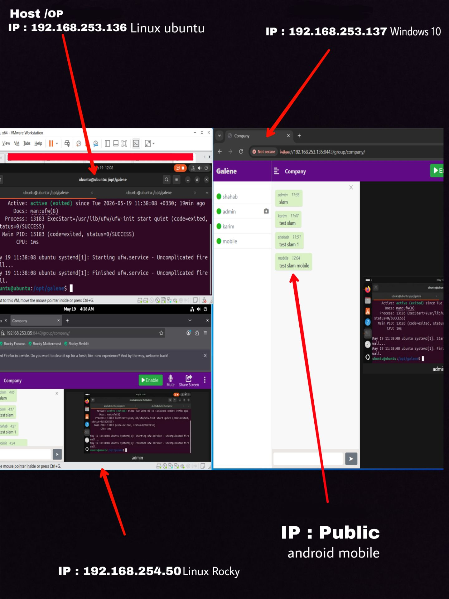

#  ماجرای راه‌اندازی یک سرویس ویدئوکنفرانس داخلی با Galene (روی شبکه ملی اطلاعات)

> داستان واقعیِ یک نیاز، یک انتخاب و یک راه‌حل متن‌باز؛ وقتی ایران در جنگ بود، اینترنت قطع شد، اما جلسات ما هنوز برقرار بودن.

<br></br>

## 🌪️ قضیه از کجا شروع شد؟

اون روزها ایران درگیر جنگ بود. اینترنت  قطع شد. وضعیت طوری شده بود که همکارهامون مجبور بودن از خونه هاشون کار کنن؛ خیابونا امن نبود، رفت و آمد سخت، و فقط چند نفر انگشت‌شمار توی شرکت حاضر می‌شدن. بقیه همه پراکنده بودن تو شهر، پشت خطوط اینترنت خانگی ناپایدار.

نیاز به برگزاری جلسات با **همه همکاران** حسابی حیاتی شده بود. نه فقط تیم فنی، بلکه جلسات مدیریتی، برنامه‌ریزی، هماهنگی‌های عملیاتی  همه چیز داشت متوقف می‌شد.

اول فکر کردیم از اپلیکیشن‌های داخلی استفاده کنیم. ولی خب، اون‌ها هم محدودیت‌های عجیبی داشتن: تعداد کاربر کم، کیفیت افتضاح، حجم آپلود کمتر از 10 مگابایت !، یا وابستگی به اینترنت خارجی. انگار نه برای جنگ، نه برای قطعی اینترنت ساخته شده بودن.

از طرف دیگه، ابزارهای خارجی مثل **Google Meet**، **SkyRoom** و **Zoom** که قبلاً استفاده می‌کردیم، دیگه غیرقابل اعتماد شده بودن. تحریم‌ها و قطع مکرر اینترنت جهانی دست به دست هم داده بود تا این سرویس‌ها عملاً از کار بیفتن.

ما به یک **بستر ویدئوکنفرانس داخلی** نیاز داشتیم که:

- **روی شبکه ملی اطلاعات (اینترانت سازمانی)** کار کنه؛ حتی اگر اینترنت خارجی کلاً از کار بیفته.
- بتونه با **تعداد محدود همکار حاضر در شرکت** و بقیه همکاران از خونه، ارتباط پایداری برقرار کنه.
- **نصب و راه‌اندازی ساده** داشته باشه، نه هفته‌ها کار تخصصی.
- روی یک **سرور معمولی لینوکسی** با کمترین منابع (مثلاً ۲ گیگ رم و یک هسته) اجرا بشه.
- امکانات پایه مثل **چت متنی**، **اشتراک صفحه** و **ضبط جلسات** رو داشته باشه.
- به **سرویس ابری خارجی** وابسته نباشه و خودمون بتونیم کاربر و اتاق (گروه) مدیریت کنیم.


### 📚 منابع رسمی برای مطالعه بیشتر:

- وبسایت پروژه: [galene.org](https://galene.org)
- مخزن گیت‌هاب: [github.com/jech/galene](https://github.com/jech/galene)
- مستندات کامل: [galene.org/galene-install.html](https://galene.org/galene-install.html)


<br></br>
<br></br>


##  چرا Galene را انتخاب کردیم؟

| توضیح | ویژگی |
|-------|-------|
| بدون نیاز به اینترنت خارجی؛ تمام ترافیک بین کاربران روی سرور داخلی می‌چرخد. | 🟢 **بومی و مستقل** |
| یک فایل باینری ~20 مگابایتی که با Go نوشته شده. بدون داکر، دیتابیس یا وابستگی اضافه. | 🟢 **فوق‌العاده سبک** |
| با یک اسکریپت خودکار (همین مخزن) می‌توانید سرور را  راه بیندازید. | 🟢 **نصب در ۱۵ دقیقه** |
| برخلاف سرویس‌های خارجی، هزینه‌ی اشتراک یا محدودیت کاربر ندارد. | 🟢 **متن‌باز و رایگان** |
| رمزنگاری سرتاسر (TLS/DTLS)، احراز هویت داخلی، قابلیت ضبط جلسات روی سرور خودتان. | 🟢 **امنیت قابل قبول** |
|<strong>op (اپراتور):</strong> مدیریت کامل جلسه (اخراج، قطع صدا، قفل اتاق، ضبط) <br> <strong>speaker (سخنران):</strong> ارسال ویدئو، صدا و اشتراک صفحه <br> <strong>present (حاضر):</strong> فقط دریافت ویدئو و چت (ارسال نمی‌کند) <br> <strong>listener (شنونده):</strong> فقط دریافت ویدئو (چت هم ندارد)  |  🟢**مدیریت کاربران و دسترسی**  |
| – تخته سفید و نظرسنجی ندارد. <br> – مقیاس‌پذیری بالا (بیش از 100 کاربر همزمان) نیازمند سرور قوی‌تر است. <br> – رابط کاربری ساده‌تر از رقبا (اما کارآمد). | 🟡 **معایب** |

</div>


<br></br>


<br></br>
<br></br>


## ⚖️ جدول مقایسه کامل قابلیت‌ها (Galene در مقابل رقبای خارجی و داخلی)

| SkyRoom / سرویس ابری داخلی |  Google Meet | Galene  |    قابلیت |
|----------------------------|-------------|---------------------|----------|
| ✅ بله (معمولاً برای احراز هویت و مدیریت) | ✅ بله (برای اتصال به سرور گوگل) | ❌ خیر | **نیاز به اینترنت جهانی** |
| ❌ غیرممکن | ❌ غیرممکن | ✅ عالی | **قابلیت کار در قطعی اینترنت** |
| ⚠️ بستگی به سرویس (اغلب در اختیار ارائه‌دهنده) | ❌ در اختیار گوگل | ✅ کامل روی سرور خودتان | **مالکیت داده‌ها** |
| معمولاً اشتراک ماهانه | رایگان محدود / پولی ماهانه | فقط سخت‌افزار سرور (یک‌بار) | **هزینه** |
| اعلام نشده  | ۱۰۰ (رایگان) تا ۵۰۰ (پولی) | ۵۰-۱۰۰ (با منابع متوسط) | **حداکثر کاربر همزمان در جلسه** |
| ✅ دارد | ✅ دارد | ✅ دارد | **چت متنی عمومی و خصوصی** |
| ✅ دارد | ✅ دارد | ✅ دارد | **اشتراک صفحه و صدا** |
|✅ دارد | ✅ دارد | ❌ ندارد | **تخته سفید، نظرسنجی، Q&A** |
| ✅ در فضای ابری سرویس | ✅ در فضای ابری گوگل | ✅ روی سرور خودتان (فایل WebM) | **ضبط خودکار جلسات** |
| ✅ دارد | ✅ دارد | ✅ دارد (SFU) | **کیفیت تطبیقی (Adaptive bitrate)** |
| ❓ نامشخص | ✅ دارد | ✅ دارد | **Simulcast (لایه‌های کیفیت)** |
| ❓ نامشخص | ✅ دارد | ✅ دارد (فقط اپراتورها صحبت کنند) | **حالت سخنرانی (Lecture mode)** |
| ❓ محدود | ✅ محدود (میزبان/شرکت‌کننده) | ✅ دقیق (۴ سطح) | **مدیریت سطوح دسترسی (op, speaker, listener)** |
| معمولاً نیاز به ثبت‌نام در سرویس | ❌ نیاز به حساب گوگل | ✅ نام کاربری/رمز   | **احراز هویت داخلی بدون حساب خارجی** |
| ❌ ندارد | ❌ ندارد | ✅ دارد | **پشتیبانی از WHIP/WHEP (ورودی از OBS)** |
| ✅ دارد | ✅ دارد (با لینک) | ✅ دارد | **امکان لاگین مهمان با رمز اتاق** |
| ✅ دارد | ✅ توسط میزبان | ✅ توسط اپراتور | **قفل کردن اتاق و اخراج کاربر** |
| ✅ (برای رسانه) | ✅ (برای رسانه) | ✅ دارد   کامل(TLS/DTLS) | **رمزنگاری سرتاسر (E2EE)** |
| گواهی معتبر سرویس | فقط گواهی معتبر | ✅ هر دو | **گواهی SSL خودامضا یا Let's Encrypt** |
| صفر | صفر | متوسط (لینوکس، شبکه) | **نیاز به تخصص فنی برای راه‌اندازی** |
| خودکار (سرور خارجی) | خودکار (سرور خارجی) | نیاز به تنظیم TURN دارد (شدنی) | **پایداری در شبکه‌های داخلی با NAT** |
|  غیرقابل محاسبه (ابر سرویس) |  غیرقابل محاسبه (ابر گوگل) |  بسیار کم (۱ هسته، ۱ گیگ رم برای ۲۰ کاربر) | **میزان مصرف منابع سرور** |


<br></br>
<br></br>


# راهنمای نصب و راه‌اندازی سرور ویدئوکنفرانس Galène روی شبکه داخلی (نسخه آفلاین با دسترسی به اینترنت)

> **هدف:** ایجاد سرویس ویدئوکنفرانس مشابه Google Meet با قابلیت چت متنی (عمومی و خصوصی) روی سرور داخلی شرکت که به اینترنت متصل است.  
> **پروژه:** [Galène](https://galene.org) – سرور سبک و متن‌باز WebRTC  
> **نسخه Ubuntu:** 24.04 (Noble Numbat)  
> **مخزن apt داخلی:** mirror.arvancloud.ir (برای دانلود بسته‌ها با سرعت بالا در قطعی اینترنت و اتصال به شبکه ملی اطلاعات چیزی به اسم نت ملی نداریم!.)


## پیش‌نیازها

- سرور Ubuntu 24.04 با حداقل ۱ هسته CPU و ۱ گیگ رم (برای ۱۰–۱۵ کاربر)
- دسترسی root روی سرور
- آیپی ثابت روی شبکه داخلی (مثلاً `192.168.253.135`)
- پورت‌های `8443` (HTTPS) و `8080` (HTTP) روی فایروال باز باشند


## ۱. تنظیم مخزن apt روی mirror داخلی آروان

برای افزایش سرعت و صرفه‌جویی در ترافیک، مخزن اوبونتو را به `mirror.arvancloud.ir` تغییر دهید.

```bash
sudo cp /etc/apt/sources.list /etc/apt/sources.list.bak
sudo vi /etc/apt/sources.list
```

ابتدا نسخه اوبونتوی خود را مشخص کنید 
```bash
lsb_release -a
```

محتوای زیر (برای Ubuntu 24.04) را جایگزین کنید(مثلاً 22.04 Noble Numbat):
```bash
deb http://mirror.arvancloud.ir/ubuntu noble main restricted universe multiverse
deb http://mirror.arvancloud.ir/ubuntu noble-updates main restricted universe multiverse
deb http://mirror.arvancloud.ir/ubuntu noble-backports main restricted universe multiverse
deb http://mirror.arvancloud.ir/ubuntu noble-security main restricted universe multiverse
```

بروز رسانی کنید :
```bash
sudo apt update
```

نصب پیش‌نیازها (Git, Go, build-essential):
```bash
sudo apt install -y git golang-go build-essential
```
از آنجا که GitHub ممکن است با اختلال مواجه شود، از پروکسی ghproxy.net استفاده می‌کنیم:
```bash
cd /opt
sudo wget https://ghproxy.net/https://github.com/jech/galene/archive/refs/heads/master.zip
sudo unzip master.zip
sudo mv galene-master galene
cd galene
```

## کامپایل Galene

ابتدا مالکیت پوشه را به کاربر جاری تغییر دهید (اختیاری ولی توصیه می‌شود):
```bash
sudo chown -R $USER:$USER /opt/galene
```
سپس کامپایل کنید:
```bash
CGO_ENABLED=0 go build -ldflags='-s -w'
```

در صورت بروز خطای دانلود ماژول‌ها، از پروکسی Go داخلی استفاده کنید:
```bash
export GOPROXY=https://goproxy.ir,direct
CGO_ENABLED=0 go build -ldflags='-s -w'

```

**پس از اتمام، فایل اجرایی galene در پوشه جاری ساخته می‌شود.**

## ایجاد اولین گروه (اتاق) با کاربر ادمین 

یک گروه (اتاق) به نام company و کاربر ادمین با دسترسی op ایجاد کنید:
```bash
mkdir -p groups
```


برای ایجاد یک اتاق (گروه) جدید در Galene، چند روش ساده وجود دارد. سریع‌ترین روش، ایجاد یک فایل JSON جدید در پوشه groups است.
```bash
cd /opt/galene/groups
```
یک فایل جدید برای اتاق خود بسازید، مثلاً sales.json (نام اتاق = sales):
```bash
sudo vi sales.json
```
```json
{
  "users": {
    "admin": {
      "password": "yourpassword",
      "permissions": "op"
    }
  }
}
```
```json
cat > groups/company.json <<EOF
{
  "users": {
    "admin": {
      "password": "yourpassword",
      "permissions": "op"
    }
  }
}
EOF
```
افزودن کاربر جدید (مثلاً اپراتور) به صورت دستی:
```bash
sudo vi /opt/galene/groups/company.json
```
```json
{
  "users": {
    "admin": {
      "password": "yourpassword",
      "permissions": "op"
    },
    "karim": {
      "password": "karim123",
      "permissions": "op"
    }
  }
}
```
## اجرای آزمایشی Galene:
```bash
./galene &
```
آیپی سرور خود را بیابید:
```bash
ip a | grep "inet " | grep -v 127.0.0.1
```

در یک کامپیوتر دیگر در همان شبکه، مرورگر را باز کرده و آدرس زیر را وارد کنید:
```bash
https://192.168.253.135:8443/group/company/
```
هشدار امنیتی (گواهی خودامضا): روی Advanced → Proceed to ... (unsafe) کلیک کنید.

صفحه ورود:

Username: "admin"

Password: "yourpassword"

پس از ورود، اجازه دسترسی به دوربین و میکروفون را بدهید.

تست چت: روی آیکون گفتگو (💬) در نوار پایین کلیک کنید و یک پیام عمومی بفرستید.


#  نصب به عنوان سرویس systemd (اجرای دائمی)

ابتدا پروسه آزمایشی را متوقف کنید:
```bash
sudo pkill galene
```

فایل سرویس ایجاد کنید:
```bash
sudo vi /etc/systemd/system/galene.service
```

محتوای زیر را وارد کنید (مسیرها را متناسب با نصب خود تنظیم کنید):
```bash
[Unit]
Description=Galene videoconference server
After=network.target

[Service]
Type=simple
User=nobody
Group=nogroup
WorkingDirectory=/opt/galene
ExecStart=/opt/galene/galene
Restart=on-failure
RestartSec=5

[Install]
WantedBy=multi-user.target
```
  ری استارت کنید:
```bash
sudo systemctl daemon-reload
sudo systemctl enable galene
sudo systemctl start galene
sudo systemctl status galene
```


باز کردن پورت‌ها در فایروال (در صورت فعال بودن UFW):
```bash
sudo ufw allow 8443/tcp
sudo ufw reload
```

برای تغییر پورت پیش‌فرض Galene از 8443 به 6556 (یا هر پورت دلخواه دیگر)، باید یک فایل پیکربندی ایجاد کنید و سرویس را مجدداً راه‌اندازی کنید:
```bash 
sudo vi /opt/galene/config.json
```
```json
{
    "https": ":6556",
    "turn": {"private": true}
}

```

سپس ری‌استارت سرویس Galene:
```bash
sudo systemctl restart galene
```

دسترسی به اتاق‌ها با پورت جدید:
```bash
https://192.168.253.135:6556/group/company/
https://192.168.253.135:6556/group/sales/
```


# دسترسی به سرور از اینترنت
سرور شما در حال حاضر یک IP داخلی دارد (مثلاً 192.168.253.135). کاربر خارجی باید بتواند به IP عمومی (Public IP) سرور شما دسترسی داشته باشد. راه‌حل‌ها:

انتشار پورت (Port Forwarding) روی روتر سازمانی: در روتر اصلی شرکت، پورت‌های 8443 (HTTPS) و در صورت نیاز 8080 (HTTP) را به IP داخلی سرور فوروارد کنید.

استفاده از آدرس دامنه: یک دامنه (مثلاً video.company.com) را به IP عمومی شرکت (که معمولاً ثابت است یا از DDNS استفاده می‌کند) اشاره دهید.
## تنظیم TURN Server 
WebRTC برای برقراری ارتباط مستقیم بین کاربران داخلی و خارجی که پشت NAT/Firewall هستند، اغلب به یک TURN server نیاز دارد (مخصوصاً اگر هر دو طرف پشت NAT متقارن باشند). راه‌حل:

استفاده از TURN داخلی خود Galene: کافی است فایل config.json را به شکل زیر تنظیم کنید:

```bash
{
    "https": ":8443",
    "turn": {
        "public-ip": "IP_عمومی_سرور_شما",
        "private": false
    }
}
```
یا راه‌اندازی یک TURN server مجزا مثل Coturn (توصیه می‌شود برای پایداری بیشتر).

 آدرس عمومی را در config.json یا با پارامتر خط فرمان به Galene بگویید
اگر سرور شما پشت NAT است (یعنی IP عمومی آن روی خود سرور نیست، بلکه روی روتر است)، باید آدرس عمومی را به Galene اعلام کنید:
```bash
./galene -https :8443 -turn-public-ip IP_PUBLIC
```

یا در config.json مقدار "public-ip": "IP_PUBLIC" را اضافه کنید.

 باز کردن پورت‌های UDP برای RTC
WebRTC از پورت‌های UDP  برای انتقال رسانه استفاده می‌کند. این پورت‌ها نیز باید روی فایروال سازمانی باز شوند و به سرور فوروارد گردند.


<br></br>


# یک جلسه واقعی با Galene در عمل

تصویر زیر یک تست از سرویس Galene روی شبکه داخلی و خارجی سازمان را نشان می‌دهد. در این جلسه، **یک ادمین** و **سه کاربر** با دستگاه‌ها و موقعیت‌های متفاوت حضور دارند. همه چیز به خوبی کار می‌کند: ویدئو، صدا، چت عمومی و اشتراک صفحه.



### شرح تصویر:

**ادمین** – با آیپی `192.168.253.136` روی **لینوکس اوبونتو** **در حال ارائه (اشتراک صفحه)** است. او دسترسی کامل (`op`) دارد و مدیریت جلسه را بر عهده دارد. در پنجره چت عمومی نیز پیامی فرستاده که برای همه قابل مشاهده است.

**کاربر اول** – با آیپی `192.168.253.137` روی **ویندوز 10** در حال **گوش دادن** است؛ یعنی ویدئو و صدای جلسه را دریافت می‌کند.

**کاربر دوم** – با آیپی `192.168.254.50` روی **لینوکس راکی** (Rocky Linux) در حال **گوش دادن** است.

**کاربر سوم** – با **موبایل اندروید** و از طریق **آیپی عمومی خودش** (خارج از شبکه داخلی سازمان) به جلسه متصل شده و در حال **گوش دادن** است. او با تنظیمات TURN و فوروارد پورت موفق شده از راه دور وارد جلسه شود.

همانطور که می‌بینید، Galene به راحتی کاربران با سیستمعامل‌های مختلف (ویندوز، لینوکس، اندروید) و در شبکه‌های داخلی و خارجی را پشتیبانی می‌کند. چت عمومی، اشتراک صفحه و کیفیت ویدئو و صدا در این تست  بود.


<br></br>

## 🚀 نصب خودکار با یک اسکریپت

اگر ترجیح می‌دهید همه مراحل به صورت خودکار انجام شود، یک **اسکریپت bash** آماده کرده‌ایم که صفر تا صد نصب و راه‌اندازی Galene را روی اوبونتو ۲۴.۰۴ انجام می‌دهد.

🔗 برای مشاهده توضیحات و دریافت اسکریپت، به پوشه [`script-auto/`](script-auto/) بروید.
